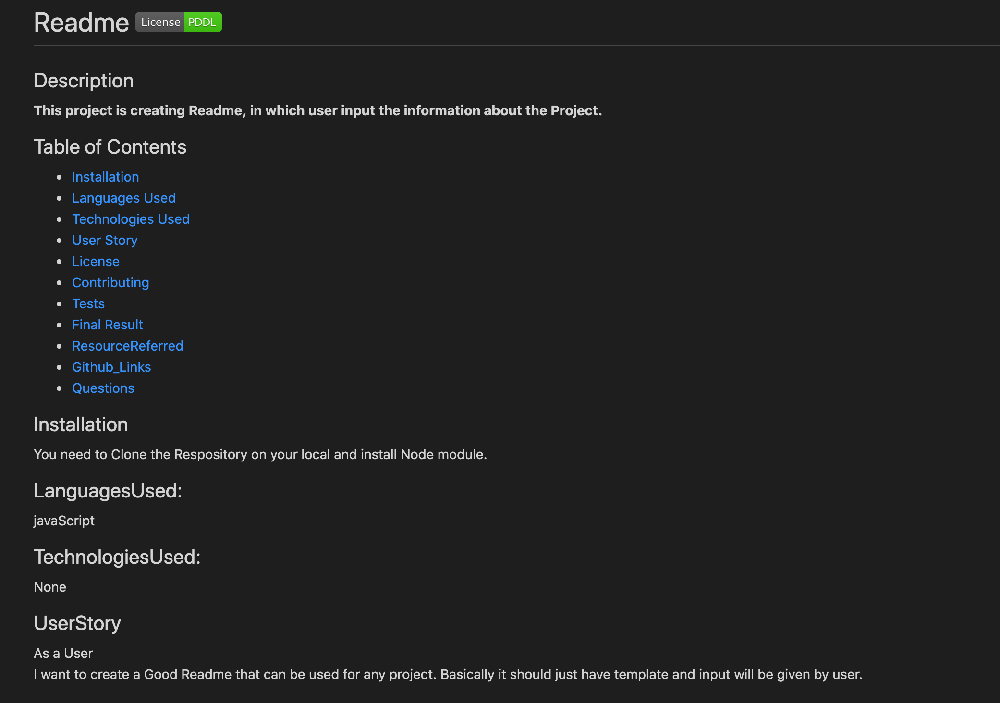
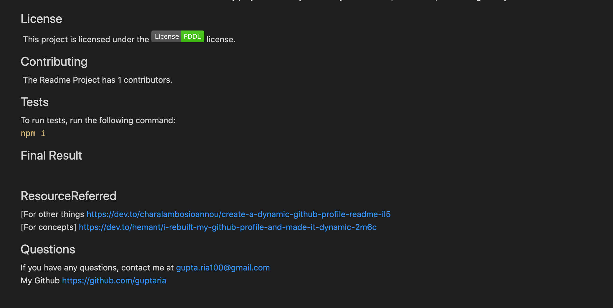
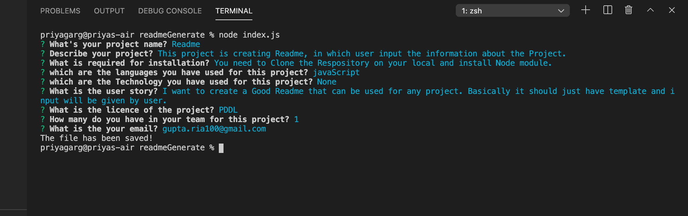

 # Readme   [](https://opendatacommons.org/licenses/pddl/)

 ## Description
 **This project is creating Readme, in which user input the information about the Project.**


 ## Table of Contents 

 * [Installation](#Installation)
 * [Languages Used](#LanguagesUsed)
 * [Technologies Used](#TechnologiesUsed)
 * [User Story](#UserStory)
 * [License](#License)
 * [Contributing](#Contributing)
 * [Tests](#Tests)
 * [Final Result](#FinalResult)
 * [ResourceReferred](#ResourceReferred)
 * [Github_Links](#Github_Links)
 * [Questions](#Questions)

 ## Installation
   You need to Clone the Respository on your local and install Node module.

 ## LanguagesUsed:
   JavaScript

 ## TechnologiesUsed:
  None


 ## UserStory
 As a User </br>
  I want to create a Good Readme that can be used for any project. Basically it should just have template and input will be given by user.


 ## License
​  This project is licensed under the [](https://opendatacommons.org/licenses/pddl/) license.

 ## Contributing
​   The Readme Project has 1 contributors.
​
 ## Tests 
   To run tests, run the following command:<br>
    ```npm i```

 ## Final Result
  
  
  


 ## ResourceReferred
 [For Badges] https://www.freecodecamp.org/news/how-to-use-badges-to-stop-feeling-like-a-noob-d4e6600d37d2/ <br>
 [For concepts] https://dev.to/hemant/i-rebuilt-my-github-profile-and-made-it-dynamic-2m6c

 ## Watch the Video
 [Demo](https://drive.google.com/file/d/1YPcLyJNYmix7Ci-8cV0hKVWhpFIXCJfb/preview)
 
 ## Questions
   If you have any questions, contact me at gupta.ria100@gmail.com </br>
   My Github https://github.com/guptaria
                

